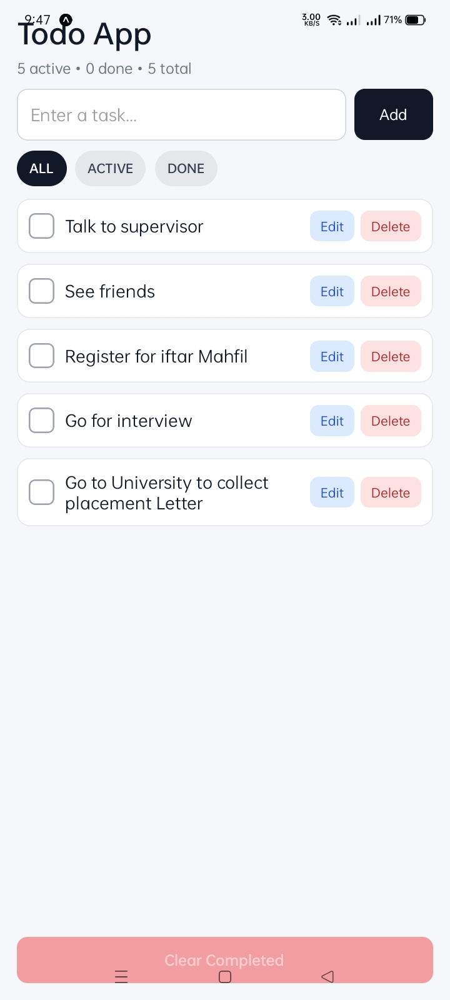
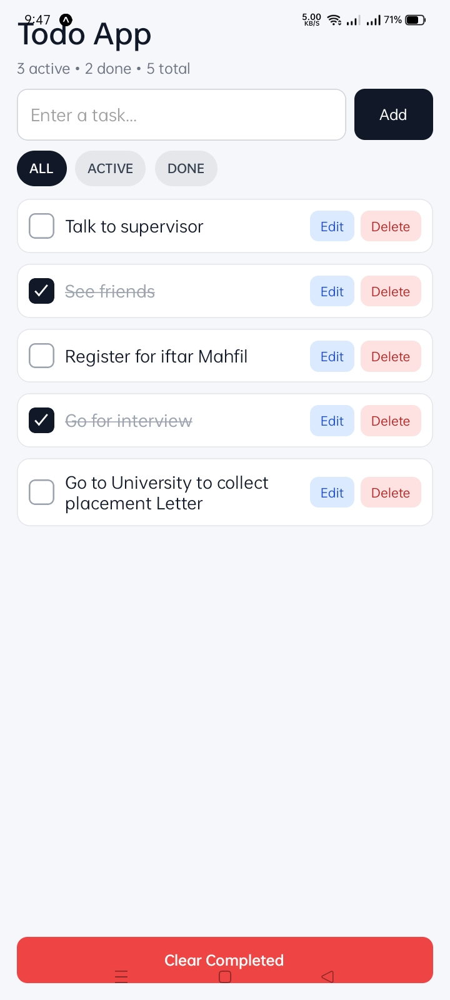
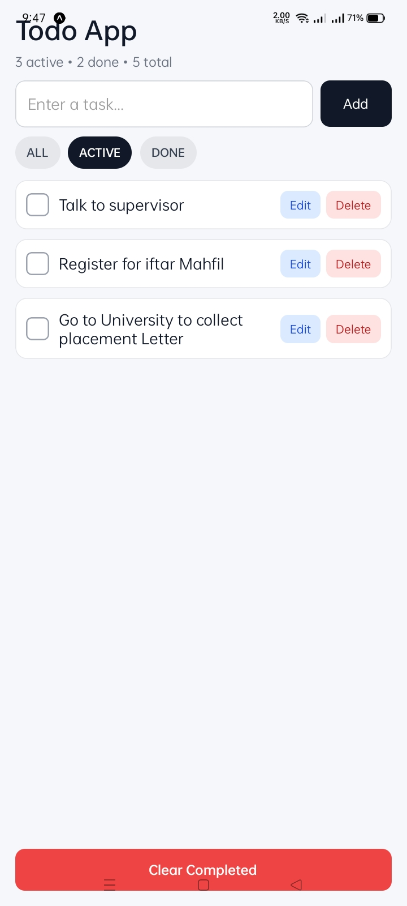
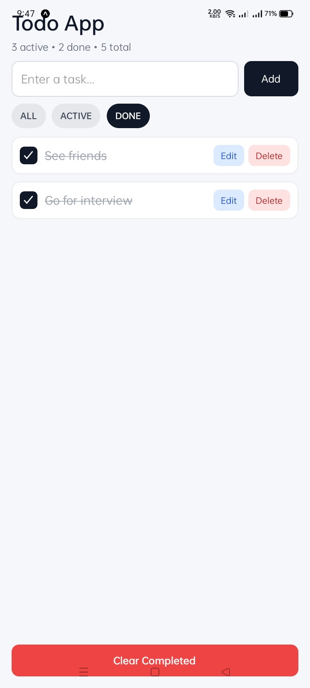

# ✅ ToDo Mobile App (React Native + Expo)

A clean, interview-ready **mobile ToDo application** built with **React Native (Expo)**.  
This project focuses on core task management functionality, local persistence, and a polished user experience with a simple and maintainable codebase.

---

## 📌 Overview

This app was built as a fast, practical mobile project for interview/demo purposes.  
Instead of overengineering, the focus was on delivering a **stable MVP+** with features users actually expect in a todo app:

- Add tasks
- Edit tasks
- Mark tasks as complete/incomplete
- Delete tasks
- Filter tasks (All / Active / Done)
- Clear completed tasks
- Persist data locally using AsyncStorage (survives app restart)

The result is a lightweight, responsive, and functional app that demonstrates:

- React Native fundamentals
- State management with hooks (`useState`, `useEffect`, `useMemo`)
- Mobile UI/UX thinking
- Local storage integration
- Clean component logic and feature iteration

---

## 🖼️ App Screenshots

> Place the screenshots (`1.jpeg`, `2.jpeg`, `3.jpeg`, `4.jpeg`) in the **root of the repository** (same level as `README.md`) for these image links to work.

### 1) Home / Empty or Initial State


### 2) Adding and Viewing Tasks


### 3) Completed Tasks / Filters


### 4) Edit Task Flow


---

## ✨ Features

### Core Features
- **Add Task**
  - Users can add a new task from the input field.
  - Empty input is safely ignored (trim validation).

- **Toggle Task Completion**
  - Tap a task (or checkbox) to mark it complete/incomplete.
  - Completed tasks are visually styled with:
    - checkmark
    - filled checkbox
    - strikethrough text

- **Delete Task**
  - Users can delete a task.
  - Includes a confirmation alert before deletion.

### Productivity Features
- **Edit Task**
  - Users can edit an existing task.
  - App supports:
    - entering edit mode
    - updating task text
    - canceling edit mode
  - UI changes dynamically (`Add` → `Update`)

- **Task Filters**
  - Filter views:
    - **ALL**
    - **ACTIVE**
    - **DONE**

- **Clear Completed**
  - One-tap cleanup to remove all completed tasks.

### Persistence
- **Local Storage with AsyncStorage**
  - Tasks are automatically saved locally.
  - Data remains available after:
    - app restart
    - reload in Expo Go

---

## 🧠 Technical Highlights (Interview Talking Points)

This project intentionally uses a **clean and practical architecture** for speed, readability, and reliability.

### 1) React Hooks-based State Management
The app uses React hooks only (no Redux required for this scope):

- `useState` → local UI and task state
- `useEffect` → load/save tasks from storage
- `useMemo` → derive filtered tasks and stats efficiently

Why this matters:
- Less boilerplate
- Faster development
- Easy to reason about in an interview setting

---

### 2) Local Persistence (AsyncStorage)
Tasks are stored using:

- `@react-native-async-storage/async-storage`

This demonstrates:
- Native-compatible persistence in React Native
- Async side effects
- Simple data serialization/deserialization (`JSON.stringify` / `JSON.parse`)

---

### 3) Defensive UX / Edge Cases Handled
The app includes practical safeguards:

- Prevent adding empty tasks
- Confirm before delete
- Cancel edit mode safely
- Disable **Clear Completed** when there’s nothing to clear
- Keep edited state consistent if item is deleted/cleared

---

### 4) Mobile-first UI Design
The UI is intentionally simple but polished:

- `SafeAreaView` for mobile layout safety
- `KeyboardAvoidingView` for better typing experience
- Large touch targets for mobile usability
- Clear visual states (active/done/editing)
- Consistent spacing and typography

---

## 🛠️ Tech Stack

- **React Native**
- **Expo**
- **JavaScript (ES6+)**
- **AsyncStorage** for local persistence

---

## 📂 Project Structure (Current)

This is currently a streamlined interview-focused setup.

```text
ToDo/
├── App.js                 # Main application logic + UI
├── package.json
├── package-lock.json
├── app.json
├── babel.config.js
├── assets/                # Expo assets (default)
├── 1.jpeg                  # Screenshot 1 (README)
├── 2.jpeg                  # Screenshot 2 (README)
├── 3.jpeg                  # Screenshot 3 (README)
├── 4.jpeg                  # Screenshot 4 (README)
└── README.md
````

> A larger production app would likely split logic into:
>
> * `components/`
> * `hooks/`
> * `utils/`
> * `storage/`
> * `constants/`

For interview speed, keeping it in `App.js` is a reasonable tradeoff.

---

## 🚀 Getting Started

### Prerequisites

Make sure you have installed:

* **Node.js**
* **npm**
* **Expo Go** (Android/iOS mobile app) OR Android Emulator

---

### Installation

Clone the repository:

```bash
git clone <your-repo-url>
cd ToDo
```

Install dependencies:

```bash
npm install
```

Start the Expo development server:

```bash
npm start
```

---

## 📱 Run on Mobile (Recommended)

### Android (Fastest)

1. Install **Expo Go** from Google Play Store
2. Ensure your phone and laptop are on the **same Wi-Fi**
3. Run `npm start`
4. Scan the QR code shown in the terminal/browser using **Expo Go**

### Alternative Options

* `npm run android` → Android emulator/device
* `npm run web` → Browser preview (for quick UI checks)

---

## 🧪 How to Test the App

Use this checklist to verify functionality:

* [ ] Add multiple tasks
* [ ] Toggle task completion
* [ ] Delete a task (confirm alert appears)
* [ ] Edit a task and update the title
* [ ] Cancel edit mode
* [ ] Filter tasks (All / Active / Done)
* [ ] Clear completed tasks
* [ ] Close/reopen the app and confirm tasks persist

---

## ⚙️ Key Implementation Details

### Task Object Shape

Each task is stored as an object similar to:

```js
{
  id: "1700000000000",
  title: "Prepare interview demo",
  completed: false,
  createdAt: "2026-02-22T12:34:56.789Z"
}
```

### Data Persistence Flow

* On app mount:

  * Load tasks from AsyncStorage
* On task state change:

  * Save updated task list to AsyncStorage automatically

---

## 📈 What This Project Demonstrates

This project showcases the ability to:

* Build and ship a complete mobile UI quickly
* Make sensible scope decisions under time pressure
* Implement CRUD operations cleanly
* Persist user data
* Handle real UX interactions (filtering, editing, confirmations)
* Deliver a professional presentation (README, screenshots, structure)

This is exactly the kind of practical execution interviewers often want to see.

---

## 🔮 Future Improvements (If Extended)

If this were expanded beyond interview scope, the next improvements would be:

* ✅ Drag and reorder tasks
* ✅ Due dates / reminders
* ✅ Priority labels (Low / Medium / High)
* ✅ Categories / tags
* ✅ Search tasks
* ✅ Dark mode
* ✅ Unit tests (Jest / React Native Testing Library)
* ✅ Component-based architecture refactor
* ✅ TypeScript migration
* ✅ Cloud sync / backend integration

---

## 🐛 Known Limitations (Intentional for MVP Speed)

* Single-screen app
* No authentication / cloud sync
* No push notifications/reminders
* No task sorting or priority yet
* Minimal folder modularization (kept in `App.js` for fast iteration)

These were intentional tradeoffs to prioritize a working and polished interview demo.

---

## 🙌 Author

**Shah Mohammad Rizvi**
Built as a React Native mobile app demo using Expo.

---

## 📄 License

This project is for educational/interview demonstration purposes.